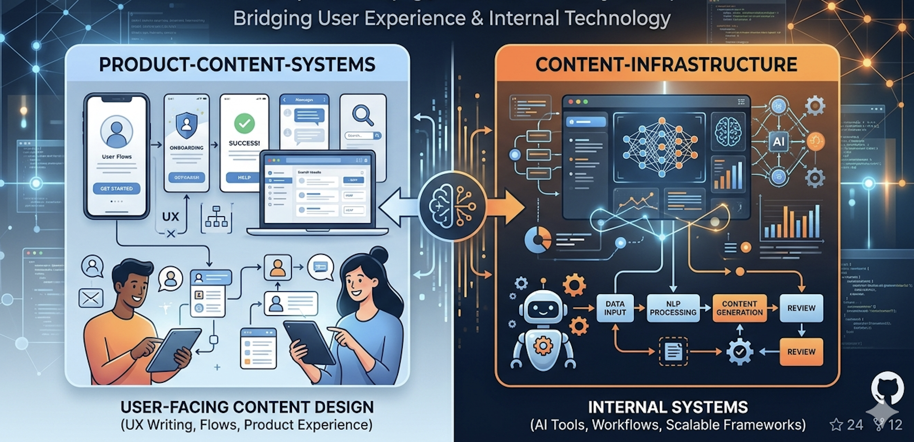

# Content Design and AI Systems

A collection of real-world Content Design projects focused on building scalable systems, AI-powered tools, and high-quality product content.

This repository reflects how content design operates in modern product teams: not just writing interface copy, but creating systems that enable consistency, speed, and quality at scale.

---
## Repository Structure

Projects in this repository are organized into two main directories:

* `product-content-systems/` → user-facing content design (UX writing, flows, product experience)
* `content-infrastructure/` → internal systems (AI tools, workflows, scalable frameworks)

Each project follows a consistent structure:

* `README.md` → overview of the project
* `system.md` → principles, frameworks, and logic
* `prompts.md` → AI prompts (for AI-based projects)
* `examples.md` → real input/output examples
* `usage.md` → how teams would use the system

This structure reflects how content design work scales in real product environments: combining strategy, systems thinking, and practical implementation.

---

## What each Directory Covers

Each of the projects within this repo is grouped into two core areas of content design:

---

### Product Content Systems

Focused on the **user-facing product experience**, including:

* UX writing
* user journeys
* in-product consistency
* interaction design with content
* collaboration with product managers and designers

These projects demonstrate how content shapes user understanding and behavior inside digital products.

**Projects:**

* AI UX Writing for Trust
* Content Audit + Fix System

---

### Content Infrastructure

Focused on **internal systems and scalability**, including:

* AI-powered content tools
* writing systems and frameworks
* workflows and automation
* content quality at scale
* enabling product teams to work autonomously

These projects demonstrate how content design scales across teams, products, and languages.

**Projects:**

* AI Tone Consistency Checker
* AI Error Message Generator
* Scalable Content Design System
* Localization + Content Workflow System

---

## Project Approach

Each project in this repository is built like a real-world product initiative:

* Problem-first thinking
* Clear system design
* Practical implementation (prompts, frameworks, workflows)
* Focus on scalability and team enablement

Where relevant, projects also include:

* AI prompt design
* Reusable content systems
* Real UI-style examples
* Workflow integration

---

## Why this Repo matters

Content design in today's date is no longer about just writing. 

It’s about:

* Designing systems
* Enabling teams
* Scaling quality
* Integrating AI meaningfully

This repository reflects that shift.

---

## About the Author

Content Designer with a background in Product, Systems thinking, and Data.

Focused on Building Scalable and AI-enabled Content & Knowledge Systems for Modern Product Teams.
